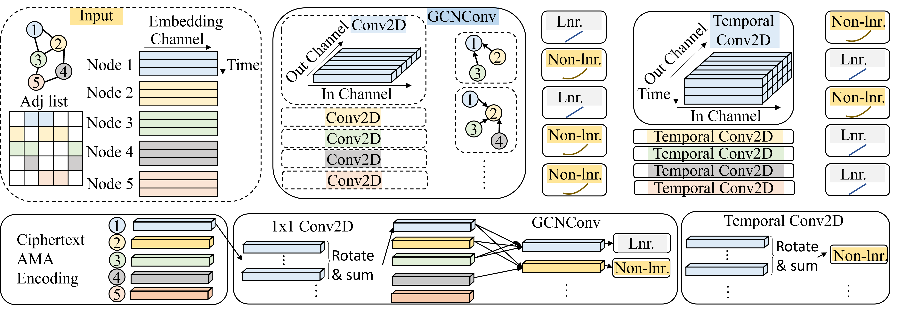

## Official implementation of "LinGCN: Structural Linearized Graph Convolutional Network for Homomorphically Encrypted Inference"


Please cite our paper if you use the code ✔
```
@inproceedings{peng2023lingcn,
  title={LinGCN: Structural Linearized Graph Convolutional Network for Homomorphically Encrypted Inference},
  author={Peng, Hongwu and Ran, Ran and Luo, Yukui and others},
  booktitle={Thirty-seventh Conference on Neural Information Processing Systems},
  year={2023}
}
```

## Overview of the LinGCN Framework

<!--  -->


We propose **LinGCN** Framework for structural **Lin**earizated **G**raph **C**onvolution **N**etwork for homomorphically encrypted inference accelerating. 

* ***Differentiable structural linearization***, LinGCN proposed a parameterized structural polarization for STGCN network, which release the freedom for each graph nodes to choose their own favored location for non-linear operation and effectively reduce the multiplication depth for homomorphic encryption. 

* ***Node-wise polynomial replacement***, LinGCN conduct teacher-guided node-wise polynomial replacement, which allows different polynomial approximation for each nodes, thus has more freedom on model architecture.  

* ***Better operator fusion***, LinGCN conduct better operator fusion for STGCN layer to further reduce the multiplication depth of Homomorphically Encrypted Inference


---

### Reminder

(This repo was forked from https://github.com/yysijie/st-gcn)

For detailed original environment setting and dataset downloading, please refer to [OLD_README.md](./OLD_README.md). We provide shortcut for dataset download and environment 

## 1. Dataset Download

Please download NTU-RGB-D dataset from [Google drive](https://drive.google.com/open?id=1CUZnBtYwifVXS21yVg62T-vrPVayso5H) described in [dataset github](https://github.com/shahroudy/NTURGB-D);
Only the **3D skeletons**(5.8GB) modality is required in our experiments. After that, this command should be used to build the database for training or evaluation:
```
python tools/ntu_gendata.py --data_path <path to nturgbd+d_skeletons>
```
where the ```<path to nturgbd+d_skeletons>``` points to the 3D skeletons modality of NTU RGB+D dataset you download.

## 2. Environment Setup
```
conda create --name LinGCN python=3.9
conda install -y pytorch==1.12.0 torchvision==0.13.0 torchaudio==0.12.0 cudatoolkit=11.6 -c pytorch -c conda-forge
conda install -c conda-forge tensorboardx
cd torchlight; python setup.py install; cd ..
pip install pyyaml==5.4.0
pip install h5py
pip install imageio
pip install scikit-video
pip install opencv-python
```

## 3. Test the Model Performance
We give 4-STGCN-3-256 model in the ```./model``` folder, and here is the test code:
```
CUDA_VISIBLE_DEVICES=0 python main.py recognition -c config/st_gcn_cleaned/ntu-xview/test_poly_reduce_3layers_2_lambda_1.yaml
```
The running result is already logged in ```./work_dir/tmp/log.txt```, you can directly check the log. The 4-STGCN-3-256 model has 4 effective non-linear layers, which is 2 layers less than the baseline model. 
## 4. Repeat the training pipeline described in the paper
We give the code to repeat the training pipeline for 4-STGCN-3-256 model. 
### 4.1. Train a Baseline Model
The training utilizes automatic mix precision with FP16 format. 
```
CUDA_VISIBLE_DEVICES=0 python main.py recognition -c config/st_gcn_cleaned/ntu-xview/train_baseline_3_layers_2.yaml
```

### 4.2. Conduct Structural Linearization
We conduct structural linearization with μ=1. This will result in a model with 4 effective non-linear layers.
```
CUDA_VISIBLE_DEVICES=0 python main.py recognition -c config/st_gcn_cleaned/ntu-xview/train_node_wise_3layers_2_lambda_1.yaml
```
### 4.3. Conduct Final Polynomial Replacement
We conduct polynomial replacement with model trained from structural linearization. The final model exhibit a smaller multiplication depth than the baseline model, and result in significant private inference speedup.  
```
CUDA_VISIBLE_DEVICES=0 python main.py recognition -c config/st_gcn_cleaned/ntu-xview/train_poly_reduce_3layers_2_lambda_1.yaml
```
## Speedups over Other Existing Works

Extensive experiments and ablation studies validate that our LinGCN effectively reduces the multiplication depth consumption and lead to more than **14.2x** latency reduction at an accuracy around 75.0% compared to [CryptoGCN](https://arxiv.org/abs/2209.11904). LinGCN proves scalable for larger models, delivering a substantial 85.78\% accuracy with 6371s latency, a 10.47\% accuracy improvement over [CryptoGCN](https://arxiv.org/abs/2209.11904).


<!--  -->


